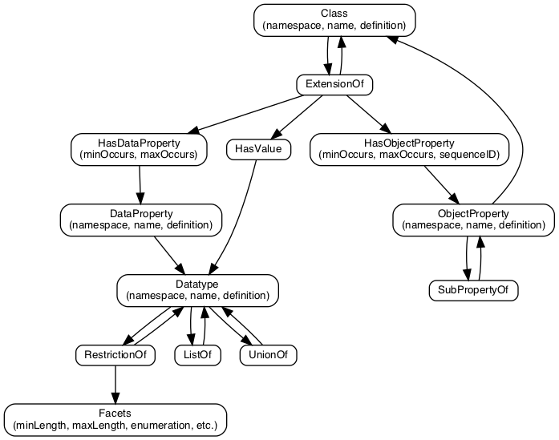

See documentation at <https://webb.github.io/niem-metamodel>.


# Introduction

The [National Information Exchange Model (NIEM)](https://niem.gov) is a standards-based approach for building interoperable information exchanges, focused on the development and reuse of a set of common data definitions. These data definitions are provided as XML Schema, suitable for use as a basis for building schemas for XML messages for interchange between systems. 

NIEM has focused on distributed, interoperable governance, enabling organizations to work together on a set of data definitions that all can use, and which work together seamlessly. NIEM has also focused on providing data and data definitions that are interoperable across systems and implementation technology. By relying on XML Schema and XML as the point of interoperability, NIEM enabled systems to be developed without a dependency on programming language, operating system platform, or database implementation. 

This repository reflects an effort to improve NIEM to allow for data defintions that are interoperable across data representation and specification technologies. This repository defines a model for NIEM data definitions, so that those definitions may be used with technologies other than XML Schema. For example, an exchange may be stood up using JSON messages, with JSON schema defining the syntax of those messages. The model, describing objects, values, and relationships between them, will be consistent across the XML Schema and the JSON schema. This consistency will ensure that data definitions can be reused across multiple technologies.

NIEM's current effort is on developing the model to define data defintions for XML Schema, JSON Schema, and UML.

## Expressing a NIEM model with different technologies


# A true metamodel

This repository holds a true *metamodel*, in that the metamodel defines itself. 

- The core of the metamodel is a model for models, represented as the XML file [metamodel.xml]({{code_root}}/metamodel.xml). 
- The XSLT transformation [generate-xsd.xsl]({{code_root}}/generate-xsd.xsl) translates the metamodel XML file into XML Schema [generated/xsd/mm.xsd]({{code_root}}/generated/xsd/mm.xsd).
- The metamodel is valid against the schema generated from itself, and so is defined by iteslf.
- The translation from the *Model for Models* to the *Schema for Models* is the same translation as the one from *Model for Messages* to the *Schema for Messages*.


# The contents of a model

A model consists of a set of data definitions, described [below](#terminology). Each of these relationships are described by the metamodel, and enforced with XML Schema and Schematron rules.



# Terminology:

The NIEM Metamodel primarily uses terms from RDFS and OWL, along with terms from XML Schema.

- Model
    - A NIEM-conformant information exchange model, release, or enterprise model.
- Namespace
    - A collection of data definitions, so that they may be managed together, and distinguised from similarly-named data definitions in other collections.
    - In NIEM, the namespace *NIEM core* is managed by the NIEM Business Architecture Committee (NBAC), and provides many objects used in most NIEM information exchanges.
- Class
    - A category of things. Instances of a class are called *objects*.
    - In NIEM, complex type `nc:PersonType` is a class, and its instances are individual people.
- Datatype
    - A category of literal values. Literal values are simple values that include strings, dates, and numbers. A literal value doesn't have its own properties, and its equivalence to another literal is evaluated only based on their values, whereas objects can have the same value and still be distinct.
    - In NIEM, the XML Schema date type is a data type.
- Object Property
    - A relationship from an instance of one class to an instance of another. An object property can also be thought of a relatiionship between classes (e.g., <q>cars have owners</q>).
    - In NIEM, element `nc:PersonName` is an object property, relating a person (who has a name) to a name object (which has parts like *given name* and *surname*).
- Data Property
    - A relationship from an instance of one class to a literal of a data type.
    - In NIEM, data properties are most frequently used to carry modifiers on simple values, like units.

# Order

Within the code for representing and processing models, consistently use this order:

1. Model
1. Namespace
1. ObjectProperty
1. Class
1. DataProperty
1. Datatype

# Class content style

Each class needs to identify its content style as one of the following:

- HasValue
- HasObjectProperty

This is self-evident, given:

1. a reference to a base type which identifies its content style, and
2. extension content (has-value has-object-property)

# Versioning

- Later: 
    - include a "Release" object, that identifies a set of namespaces.
    - include versioning info, identifying relationships between versions of components
        - a namespace as a new version of another namespace
        - a class as a new version of a class
            - a class as *merging* two independent classes
    - include some kind of object that represents the concept of a namespace across multiple versions (e.g., the Justice domain *in general*).
    
    
# Relevant Specifications

- Constraning facets: <https://www.w3.org/TR/xmlschema-2/#rf-facets>
- List & Union: <https://www.w3.org/TR/xmlschema-2/#atomic-vs-list>

# Todo and Options #

## Be a suitable representation for wantlists

- How to cover profiling?
    - profile of a class:
        - don't need a base class
        - it doesn't have the "extensionof" semantic
        - it doesn't need to indicate the "hasvalue", as that's required
        - it needs has*property elements for "element in a type"
                - there's not a simple way to wantlist "an element in a type" or "an attribute in a type".
                    - at this point, a reference to a type is just a pointer to the type
                    - I could have a "profile" element containing Has*Property elements
                - Write something that generates a regular wantlist from the metamodel.

## Find a good way to handle augmentations

- We don't represent augmentations in the metamodel
- It'd be nice for a model to be able to use its own augmentation points
- We'll need to identify specific augmentation types and let domains build augmentation elements.

## Determine what level of detail the model should hold

- We could / should treat the representation of a component name as a CamelCasedName with a representation term as conforming to an implementation-specific convention.
- Our NDR specifies that component names are structured:
    - Each name has up to 3 terms; specifically a subject, property, and representation term.
    - Each term may have multiple words, and some of those words may be modifiers of the main words
- We could have the model carry the component names as structured names, rather than as CamelCaseNames. 
- We could leave out the representation terms from the structured names, carrying that as data associated with a property or type.

For example, the current model holds:

```xml
<Name>PersonGivenName</Name>
```

It could instead hold

```xml
<Name>person given name</Name>
```

With this representation, both the <q>Person</q> element and the <q>PersonType</q> complex type could have the same name, <q>person</q>, with the <q>Type</q> suffix automatically applied in translation from the model to XSD.

Or, you could break down names into parts:

```xml
<Name>
  <SubjectTerm>person</SubjectTerm>
  <PropertyTerm>given name</PropertyTerm>
  <RepresentationTerm>name</RepresentationTerm>
</Name>
```

One reason that we've never put a representation of term breakdown into the
model is that it any representation for it is exceedingly klunky and verbose.

There's not a good way to construct this breakdown from the XSD names
automatically, so translations to map between XSD and models would be lossy.

## Migrate NDR Rules to apply to models

Some NDR rules would be better fit to models than XML Schemas. Then those rules
could be applied to all implementations of models (e.g., JSON Schema, UML).

How would you write a rule that applied to a model and not a schema? If you did
Schematron, you'd still be pegged to XML representations of a model. You could
do Schematron with a language binding to Javascript, but that would be processed
with new code.

## Other options

- Handle attribute use (required, prohibited, etc).
- Add min / max occurs restrictiosn
    - 0-1 for attributes
    - min <= max


