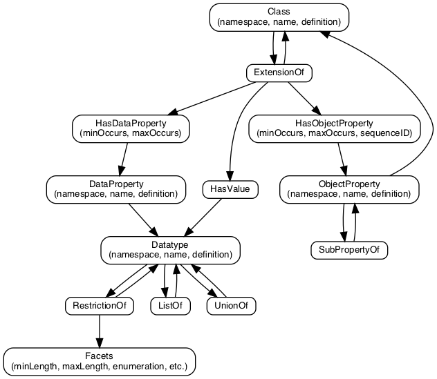

# How we got here
- NIEM focused on interoperability of data across communities
    - Multiple levels of governance: core, domains, exchange
    - Everything extensible and reusable
- NIEM focused on interoperability of data across systems
    - System-independent data & data definitions
    - Supported by free & open standards and tools
- NIEM data definitions were exclusively represented as XML Schema
- NIEM data was exchanged as XML
- NIEM data definitions were used with other technologies as applications of XML

# Where we are now
NIEM extended support to other uses of NIEM
Support for UML via the NIEM UML Profile
Support for JSON via the NIEM JSON Specification
Shortcomings
UML profile is limited to NIEM 3, few tools, and IEPD creation
There is no tool support for NIEM for JSON
Non-XML adopters of NIEM are required to build XML Schema for exchange definitions, hindering non-XML adopters
# Next requirement
Expand beyond interoperability across communities and systems
Add a focus on interoperability of data across technologies
Initial focus is on JSON and UML support
Provide interoperability between NIEM data definitions and other formats
NIEM data definitions ↔︎ UML models
NIEM data definitions ↔︎ JSON Schema
Represent NIEM data definitions in other formats
Represent other formats as NIEM data definitions
Candidate Data Standards and Tools
Spreadsheets to support governance
XML, XML Schema
JSON, JSON Schema
RDF Schema & Web Ontology Language
Linked Open Data via JSON-LD and RDF
Unified Modeling Language (UML)
Schema for relational databases
Apache Avro
Protocol Buffers
GraphQL
Human consumption: diagrams & documentation
Support for a NIEM tool architecture
The NTAC has put forward a NIEM tool architecture that provides for generation of different representations of NIEM data definitions
including JSON, UML, and documentation
A piece of this is a representation of NIEM data models
A "model description" that can be a basis for generating representations of NIEM for different technologies
Serves the function of a wantlist and extension schemas
The "model description" contains what we think of as NIEM data definitions
Current work: a data model for NIEM data definitions
AKA a NIEM metamodel
It defines a class of data objects that describe a NIEM data models (a "model description" data object)
Represents the aspects of NIEM model that we care about, without a focus on XML Schema-specific features
It describes what the NIEM model is:
Namespaces: collect and label data components so that they can be governed and distinguished
Data components have names, namespaces, and human-readable definitions
Types: represent things and values
Classes that define categories of objects
Datatypes that define categories of text: strings, dates, enumerations
Properties: represent relationships and characteristics
Object properties: represent relationships to objects
Map to XML Schema elements
Data properties: represent relationships to simple data values
Map to XML Schema attributes
What we have done so far
The NTAC is drafting a metamodel 
represents a NIEM model (NIEM data definitions) as a data object
We can represent NIEM reference schemas as a "model description" data object
Most features are supported, but not necessarily all; it's a draft
This could be handled as XML, JSON, or other formats
We can convert NIEM data descriptions into conformant XML Schema
We have the metamodel represented as data
Next steps
Ensure the metamodel covers all needed NIEM features: externals, augmentations, "wantlist" functionality
Map the metamodel to needed technologies
RDF, JSON Schema, UML
Make it part of a tool architecture 
Use it to provide tool support for other NIEM representations
END
Phase 1: Modularize Core Services
Phase 2: Improved Function via Additional Services

# This is a slide

This is some text on a slide.

# another title

 
 
 
